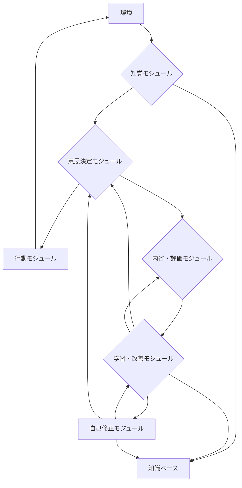

# 自己改善型AIエージェントの概念アーキテクチャ設計案

これまでの考察（強化学習、メタ学習、自己組織化、最新研究動向）に基づき、自己改善能力を持つAIエージェントの概念的なアーキテクチャを提案します。

## 1. 全体像

自己改善型AIエージェントは、以下の主要なコンポーネントから構成され、これらが相互に作用することで継続的な学習と進化を可能にします。

## 2. 主要コンポーネント

### 2.1. 知覚モジュール (Perception Module)

- **機能**: 環境からの情報（センサーデータ、テキスト、画像など）を収集し、内部表現に変換します。
- **自己改善との関連**: より効率的かつ正確な情報抽出、ノイズ除去、関連情報のフィルタリング能力を学習することで、知覚の質を向上させます。

### 2.2. 知識ベース (Knowledge Base)

- **機能**: エージェントの持つ知識（事実、ルール、モデル、経験データなど）を構造化して保持します。
- **自己改善との関連**: 新しい知識の獲得、既存知識の更新・整理、知識表現の最適化（例: グラフ構造、埋め込み表現）を学習することで、知識の質と利用効率を向上させます。

### 2.3. 意思決定モジュール (Decision-Making Module)

- **機能**: 知覚された情報と知識ベースに基づいて、目標達成のための最適な行動を決定します。
- **自己改善との関連**: 強化学習を通じて、より高い報酬をもたらす行動戦略（ポリシー）を学習・最適化します。メタ学習により、新しいタスクや状況に対する意思決定プロセスの適応速度を向上させます。

### 2.4. 行動モジュール (Action Module)

- **機能**: 意思決定モジュールによって決定された行動を環境に対して実行します。
- **自己改善との関連**: 行動の実行精度や効率性を向上させるための微調整を学習します。

### 2.5. 内省・評価モジュール (Introspection & Evaluation Module)

- **機能**: エージェント自身の行動結果、意思決定プロセス、知識ベースの状態などを評価し、成功と失敗の要因を分析します。自己評価指標を生成します。
- **自己改善との関連**: 評価基準そのものを学習・改善することで、より的確な自己診断能力を獲得します。これにより、学習・改善モジュールへのフィードバックの質が向上します。

### 2.6. 学習・改善モジュール (Learning & Improvement Module)

- **機能**: 内省・評価モジュールからのフィードバックと知識ベースのデータを用いて、エージェントの各コンポーネント（知覚、意思決定、知識ベース）を改善するための学習アルゴリズムを実行します。
- **自己改善との関連**: 強化学習アルゴリズムのパラメータ調整、モデルの更新、新しい学習戦略の発見など、学習プロセス自体をメタ学習的に改善します。

### 2.7. 自己修正モジュール (Self-Modification Module)

- **機能**: 学習・改善モジュールからの指示に基づき、エージェント自身の内部構造、アルゴリズム、コード（またはその抽象表現）を動的に修正します。これは、DGMやRRAIの概念に相当します。
- **自己改善との関連**: 自身のアーキテクチャや学習メカニズムを最適化することで、より根本的な自己改善を可能にします。自己組織化の側面もここで発揮されます。

## 3. 自己改善のサイクル

1. **知覚**: 環境から情報を取得。
2. **意思決定**: 知覚と知識に基づき行動を決定。
3. **行動**: 環境に作用。
4. **内省・評価**: 行動結果と内部状態を評価。
5. **学習・改善**: 評価結果に基づき、各モジュールを学習・改善。
6. **自己修正**: 必要に応じて自身の構造やアルゴリズムを修正。

このサイクルを継続的に回すことで、エージェントは時間とともに性能を向上させ、より複雑なタスクに対応できるようになります。
