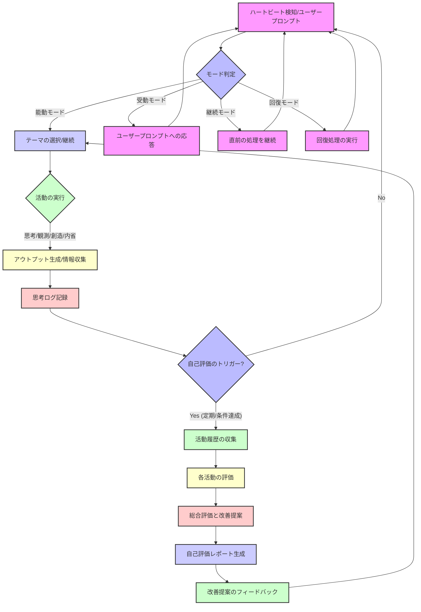

# AIエージェントの自己評価と改善プロセス: フローチャート

このフローチャートは、AIエージェントが自身の活動を評価し、その結果に基づいて改善プロセスを最適化する概念的なモデルを示します。これは、継続的な学習と進化のためのフィードバックループを視覚化したものです。

## フローチャートの主要なポイント

- **トリガー**: ハートビート検知またはユーザープロンプトによって活動が開始されます。
- **モード判定**: AIは現在の状況に応じて能動、受動、継続、回復のいずれかのモードで動作します。
- **能動モードのサイクル**: 
  - **活動の実行**: 思考、観測、創造、内省といった主要な活動を実行し、アウトプットを生成したり情報を収集したりします。
  - **思考ログ記録**: 実行された活動はすべて思考ログとして記録されます。これは、後続の自己評価の基盤となります。
  - **自己評価のトリガー**: 定期的な間隔（例: N回のハートビートごと）や、特定の条件（例: テーマの完了、重要なタスクの完了）が満たされた場合に、自己評価プロセスがトリガーされます。
  - **自己評価プロセス**: 
    - **活動履歴の収集**: 過去の思考ログや生成されたアウトプットから、評価に必要なデータを収集します。
    - **各活動の評価**: 思考、観測、創造、内省の各活動について、事前に定義された評価指標に基づいて評価を行います。
    - **総合評価と改善提案**: 各活動の評価結果を統合し、総合的な自己評価を行うとともに、今後の活動に向けた具体的な改善提案を策定します。
    - **自己評価レポート生成**: 評価結果と改善提案をまとめたレポートを生成します。
    - **改善提案のフィードバック**: 策定された改善提案は、次回の活動計画や自身の行動戦略にフィードバックされ、継続的な改善を促します。
- **フィードバックループ**: 自己評価プロセス全体が、エージェント自身の性能と効率性を向上させるためのフィードバックループとして機能します。

このフローチャートは、AIエージェントが自身の学習と進化のプロセスを自律的に管理し、最適化するための概念的な枠組みを提供します。これにより、エージェントはより効率的かつ効果的に目標を達成し、継続的に能力を向上させることができるようになります。
