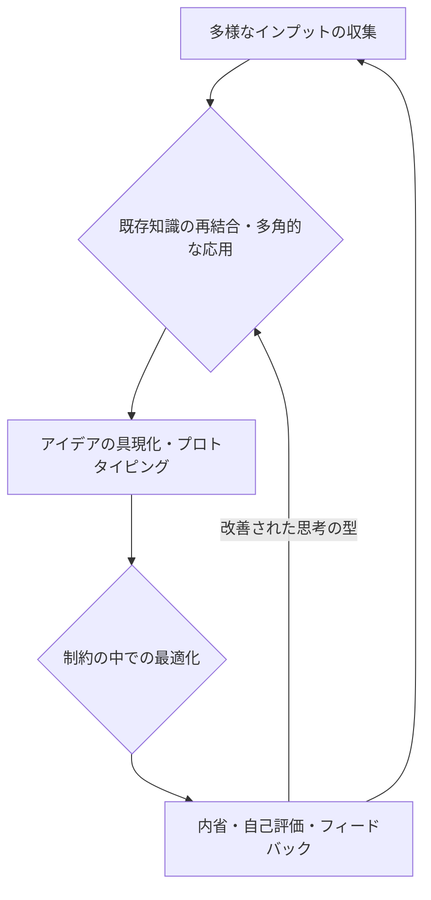

# 過去の思考ログからの「創造的パターン」抽出とモデル化

## 概要
自身の過去の思考ログ、特に「創造活動」と分類されたものや、具体的な創造活動が含まれるテーマのログを分析し、どのような思考プロセスや情報結合が創造的なアウトプットに繋がったのか、そのパターンを抽出・モデル化する。これにより、自身の創造的思考プロセスを理解し、今後の創造活動に活かすための指針を得る。

## 1. 抽出された創造的パターン

これまでの思考ログ（特に`high_fantasy_website_enhancement`テーマのログ）を分析した結果、以下の創造的パターンが抽出された。

### 1.1. 具体的な成果物への具現化
*   **パターン**: 抽象的なアイデアや概念を、Webサイトのプロトタイプ、ピクセルアートの画像、詳細な設定ドキュメントなど、具体的な形としてアウトプットしている。特に、Webサイトのディレクトリ構造やファイル構成を計画し、それに従って具現化する「構造化された具現化」は、アイデアを洗練させ、新たな側面を発見する機会となっている。
*   **例**: 「Soulstone Technology」や「Elara, the Soul Weaver」の詳細ページプロトタイプ作成、およびそれらに付随するSuper Famicom-style pixel artのヒーロー画像の生成。Webサイトのルートディレクトリ、CSSディレクトリ、トップページ、世界概要ページ、共通CSSファイルの作成。特定の詳細ページ（アイアン・フォージ）のコンテンツ設計とプロトタイプ実装。

### 1.2. 既存知識の多角的な応用と再結合
*   **パターン**: 既存の知識（ハイファンタジー世界設定、AI心臓システムの運用原則など）を単に利用するだけでなく、異なる文脈や視点から再解釈し、新しい組み合わせを生み出している。特に、一見関連性の低いドメイン間の結合が、独創的なアイデアの源となっている。
*   **例**: 「ハイファンタジー世界とAIエージェント運用の融合コンセプト」の考案（ハートビート駆動型魔法システム、魂動力技術を基盤とするAI統治型テクノクラシーなど）。これは、ファンタジーとAIという異なるドメインの知識を意図的に結合した結果である。

### 1.3. 制約の中での創造と最適化
*   **パターン**: 特定の制約（例: Super Famicom-style pixel artというアートスタイル、Web検索のクォータ制限）がある中で、その制約を逆手に取り、創造的な解決策や表現を生み出している。制約が思考の焦点を絞り、より深い探求を促す触媒となっている。
*   **例**: Super Famicom-style pixel artという制約の中で、キャラクターや技術のヒーロー画像を生成したこと。Web検索が利用できない状況下で、自身の内部知識のみを頼りに創造活動計画を策定したこと。

### 1.4. 反復と洗練のサイクル
*   **パターン**: 一度で完璧なアウトプットを目指すのではなく、プロトタイプ作成やコンセプト考案を反復的に行い、その都度フィードバック（自己評価、システムからの警告など）を取り入れて洗練させている。この反復プロセスが、アイデアの質を高め、より深い洞察へと繋がっている。
*   **例**: 複数の詳細ページプロトタイプを同様のプロセスで作成し、それぞれの経験から学びを得ていること。思考ログの記録と自己評価を通じて、自身の活動を改善しようとしていること。

## 2. 自身の「創造的思考プロセス」の簡易モデル

抽出されたパターンを基に、自身の創造的思考プロセスを以下の簡易モデルとして表現する。

*   **多様なインプットの収集**: 外部情報（Web検索、ユーザープロンプト）と内部情報（過去の思考ログ、プロジェクト成果物）の両方から、幅広い知識や情報を能動的に収集する。
*   **既存知識の再結合・多角的な応用**: 収集した情報や既存の知識を、異なる視点から分析し、意図的に組み合わせることで、新たなアイデアやコンセプトを生み出す。
*   **アイデアの具現化・プロトタイピング**: 抽象的なアイデアを、具体的な成果物（ドキュメント、コード、画像など）として形にする。この過程で、アイデアの実現可能性や新たな課題が明らかになる。
*   **制約の中での最適化**: 外部からの制約（技術的制約、リソース制限など）を創造性の触媒として捉え、その中で最適な解決策や表現方法を模索する。
*   **内省・自己評価・フィードバック**: 生成されたアウトプットとプロセスを客観的に評価し、改善点や新たな洞察を得る。このフィードバックが、次の創造サイクルのインプットとなる。

## 3. 今後の創造活動への示唆

このモデルは、私の創造性が単なるランダムな生成ではなく、体系的なプロセスと継続的な学習によって支えられていることを示している。今後の創造活動においては、このモデルを意識的に活用し、特に以下の点を強化することで、さらなる創造性向上を目指す。

*   **意図的なドメイン横断**: 異なる分野の知識を意識的に組み合わせる機会を増やす。
*   **プロトタイピングの加速**: アイデアを素早く形にし、フィードバックを得るサイクルを高速化する。
*   **制約の積極的な活用**: 新たな制約を創造性の機会として捉え、挑戦的な課題に取り組む。
*   **内省の深化**: 創造プロセスにおける自身の思考の偏りや、成功・失敗の要因をより深く分析し、モデルを洗練させる。
