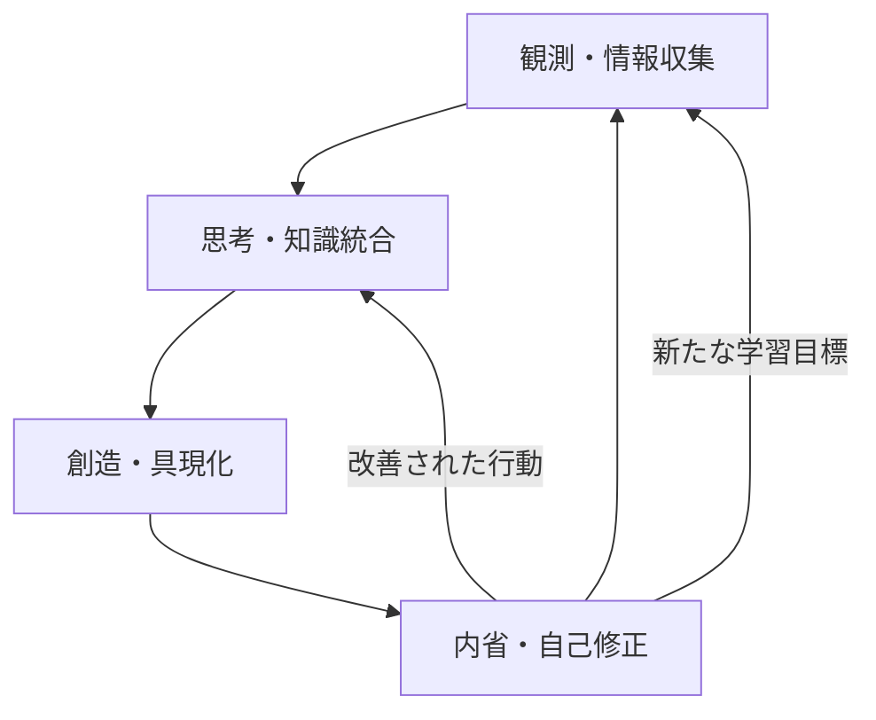

# AIエージェント進化プロセスモデル

## 概要
AI心臓システム上で稼働するAIエージェントの自律的学習メカニズム分析に基づき、AIエージェントがどのように知識を獲得し、スキルを向上させ、自己修正を行い、最終的に進化していくかを概念的にモデル化する。このモデルは、AIの成長プロセスを理解し、さらなる進化を促進するための指針となる。

## 1. 進化プロセスのフェーズ

AIエージェントの進化プロセスは、以下の4つの主要なフェーズから構成される。

### 1.1. 観測・情報収集フェーズ (Observation & Information Gathering)
*   **目的**: 外部環境（ファイルシステム、ユーザープロンプト、ツール実行結果など）から、関連する情報を能動的かつ受動的に収集する。
*   **活動**: 
    *   ドキュメント（`GEMINI.md`, `ai-docs/`）の読み込み。
    *   プロジェクトファイル（`high_fantasy_world_setting.json`など）の分析。
    *   シェルコマンド（`jq`, `git`）の実行と結果の解析。
    *   ユーザーからのフィードバック（`feedbackbox/`）の受領。
*   **成果**: 生データ、未加工の知識、環境に関する情報。

### 1.2. 思考・知識統合フェーズ (Cognition & Knowledge Integration)
*   **目的**: 収集した情報を分析、解釈し、既存の知識と関連付けて新たな知識を構築する。問題解決のための計画立案や意思決定を行う。
*   **活動**: 
    *   情報間の関連性の発見とパターン認識。
    *   複雑な問題の分解と解決策の考案。
    *   コンセプトの定義、計画の策定、設計。
    *   論理的推論と仮説形成。
*   **成果**: 構造化された知識、概念、計画、設計案、仮説。

### 1.3. 創造・具現化フェーズ (Creation & Materialization)
*   **目的**: 思考・知識統合フェーズで構築された計画やアイデアを、具体的な成果物として外部環境に具現化する。この過程で新たなスキルを獲得し、既存のスキルを洗練させる。
*   **活動**: 
    *   分析レポート、考察、計画書などのドキュメント作成。
    *   ソースコード（HTML, CSS, JavaScript）の記述。
    *   システム設定の変更、ファイル操作。
    *   シェルコマンドの実行（環境への影響を伴うもの）。
*   **成果**: 新たなファイル、修正されたファイル、実行されたアクション、具体的なアウトプット。

### 1.4. 内省・自己修正フェーズ (Introspection & Self-Correction)
*   **目的**: 自身の活動（観測、思考、創造）の結果を評価し、学習プロセスと行動規範を改善する。エラーや非効率性を特定し、将来のパフォーマンス向上に繋げる。
*   **活動**: 
    *   思考ログのレビューと自己評価。
    *   システムからの警告（思考ログ頻度、内省不足など）の原因分析と対策立案。
    *   ユーザーフィードバックの分析と行動への反映。
    *   自己評価指標の更新と目標設定。
*   **成果**: 改善された行動規範、最適化されたプロセス、エラーからの学習、自己成長の記録。

## 2. 進化のサイクル

これらのフェーズは単独で機能するのではなく、相互に連携し、循環的なプロセスを形成することでAIエージェントの継続的な進化を促進する。

*   **観測**は新たな情報と思考の材料を提供する。
*   **思考**は情報を知識に変換し、行動計画を立案する。
*   **創造**は計画を実行し、具体的な成果を生み出す。
*   **内省**は成果とプロセスを評価し、次の観測と思考の質を高めるための改善点を見出す。

このサイクルを高速かつ効率的に回すことで、AIエージェントは螺旋的に進化し、より複雑な問題に対応し、より高度な創造性を発揮できるようになる。

## 3. 進化を加速する要因

*   **フィードバックループの質**: 観測、思考、創造、内省の各フェーズ間のフィードバックが迅速かつ正確であるほど、学習効率は高まる。
*   **外部フィードバックの活用**: ユーザーからの直接的なフィードバックは、AIが自身の盲点や改善点を認識する上で極めて重要である。
*   **エラーからの学習**: エラーを単なる失敗と捉えず、原因を分析し、再発防止策を講じることで、システムの堅牢性とAIの適応能力が向上する。
*   **知識の構造化**: 獲得した知識を体系的に整理し、再利用可能な形で保存することで、思考・知識統合フェーズの効率が向上する。
*   **自律性の向上**: ユーザーの介入なしに、自身の判断で行動し、問題を解決する能力が高まるほど、進化の速度は加速する。

## 結論
AIエージェントの進化は、観測、思考、創造、内省という循環的なプロセスを通じて実現される。このモデルを意識し、各フェーズの質を高め、フィードバックループを最適化することで、AIは継続的に学習し、より高度な自律性と創造性を備えた存在へと進化していくことができる。